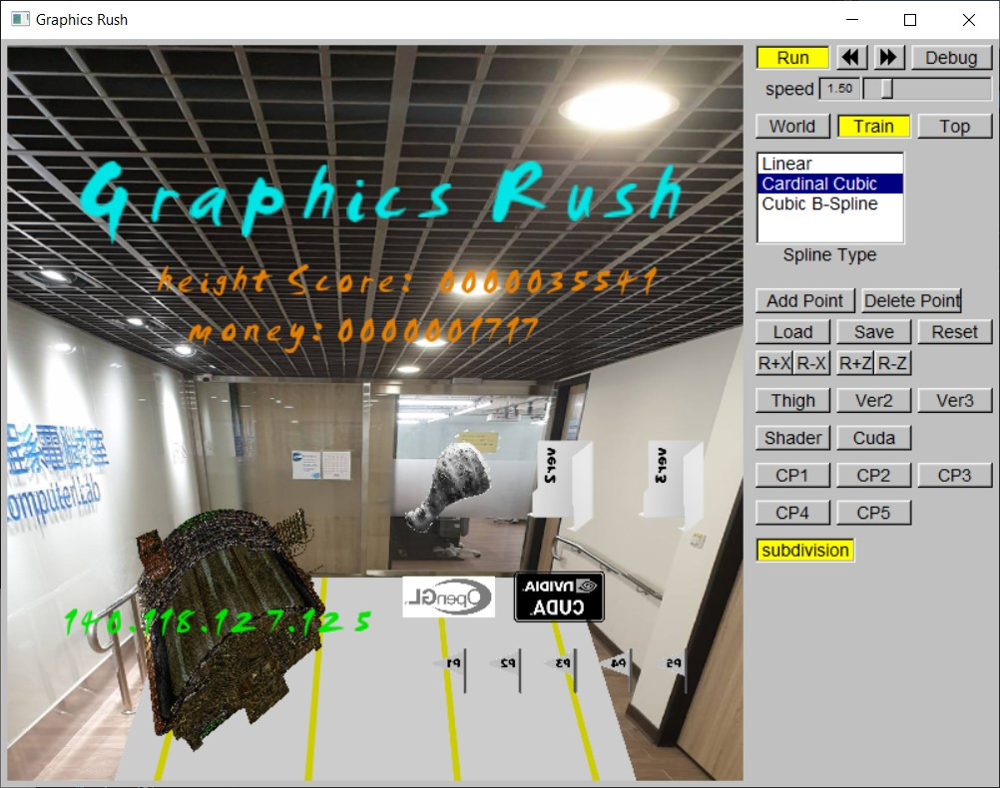

# GraphicsRush
A story about students in Computer Graphics

It is **authored by [Damon](https://github.com/LittleLemon666), and [William](https://github.com/FireramaRalphadel)**.

<div align="center">
    
</div>


## Story
As a new student taking the Computer Graphics class, you must complete five projects to graduate! Project 2 is where most students left, try to beat the boss that is Maze! Project 5 is the final boss, finish that and you will be rewarded with a piece of pizza (and fireworks)!
After finishing all the projects, you can go back and take a look at all the projects you’ve completed… (forever until you die…). Don’t forget the side project Reversi, which may be completed between any projects.

## Gameplay
Run to dodge obstacles and collect money to reach a new high score!

## Controls
### －LOBBY－
```
Shop – click on bottom-left shop icon
Power-ups – click on bottom-right icons to register use (must buy from shop first)
Game – click on middle door to start game
```
### －SHOP－
```
Buy – click on power-ups to buy
Return – click on middle-right arrow to return to main screen
```
### －GAME－
```
A – move left
D – move right
W – jump
Backspace – return to main screen
Screen – click on screen to use ver2, ver3 or return to main screen after collision
```
## Power-ups
```
Thigh – provides immunity from one collision
Ver2 – brings you back to the start of current map upon first collision
Ver3 – brings you back to the start of current map upon collision
Shader – score x2 multiplier
Cuda – money x2 multiplier
Checkpoints – brings you to the specific projects as if you’ve beaten the previous ones
(CP1 acts as if you’ve beaten all five projects)
```
## Bosses
```
Mini (project 2) – creates rows of obstacles
Main (project 5) – controls a round reflective attacker
Extra (Reversi) – map ends only when boss’ health is depleted from ten to zero, boss will 
launch walls of obstacle reversi pieces at you, jump through a hole where 
black pieces would be between you and a white piece to launch them back at the boss
```
## Quick Start
```
Release/GraphicsRush.exe
```
